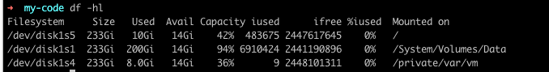

# df - 显示磁盘相关信息

## 补充说明

df 命令用于显示磁盘分区上的可使用磁盘空间。默认单位为 KB。可以利用该命令来获取
磁盘占用了多少空间，目前还剩下多少空间信息。

## 语法

```bash
df (选项)(参数)
```

## 选项

|选项| 描述| 补充|
|:---|:---|:---|
|-a(all)|包含全部的文件系统||
|-l(local)| 只显示本地端的文件系统||
|-h(human-readable)|以可读性较高的方式来显示信息| 所谓的 inode 是用来存放档案及目录的基本信息 (metadata)，包含时间、档名、使用者及群组等。在分割扇区时，系统会先做出一堆 inode 以供以后使用，inode 的数量关系着系统中可以建立的档案及目录总数。如果要存的档案大部分都很小，则同样大小的硬盘中会有较多的档案，也就是说需要较多的 inode 来挂档案及目录。|


## 输出分析



|title| descripton|
|:---|:---|
|Filesystem|磁盘分区|
|Size|磁盘分区的大小|
|Used|已使用的空间|
|Avail|可用空格|
|Capacity||
|iused||
|ifree||
|%iused||
|Mounted on|挂载点|

## 参考链接

1. [df 命令，Linux df 命令详解：显示磁盘的相关信息 -  Linux 命令搜索引擎](https://wangchujiang.com/linux-command/c/df.html)
