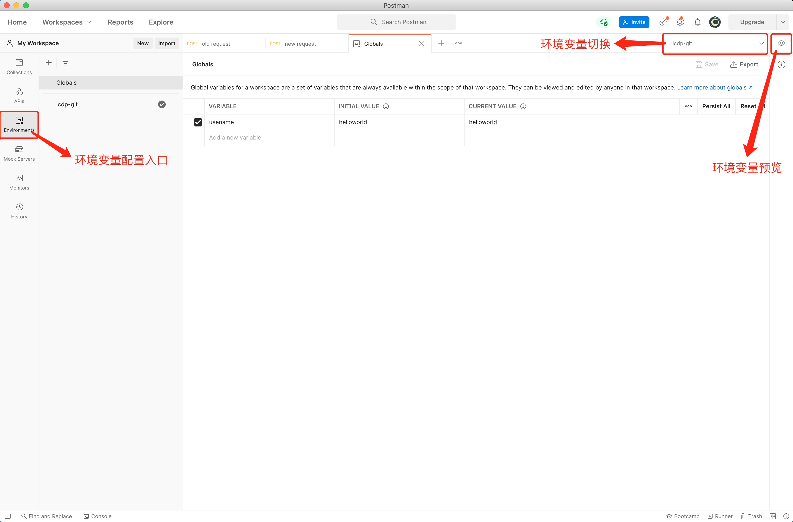
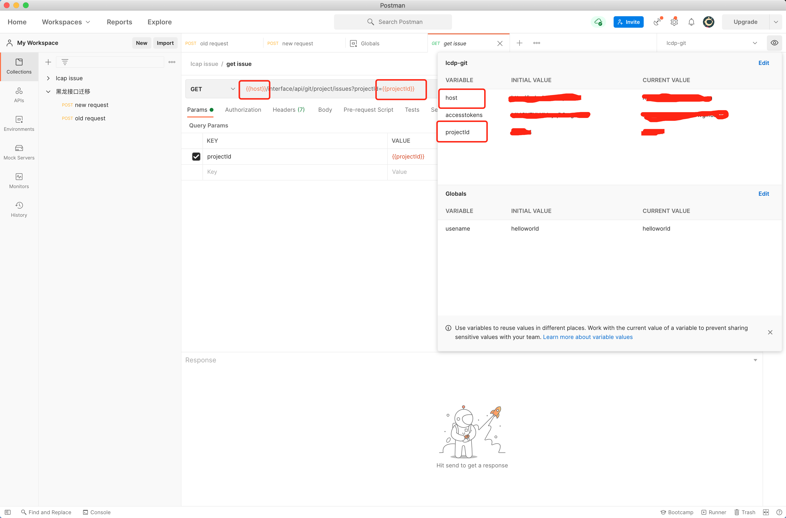
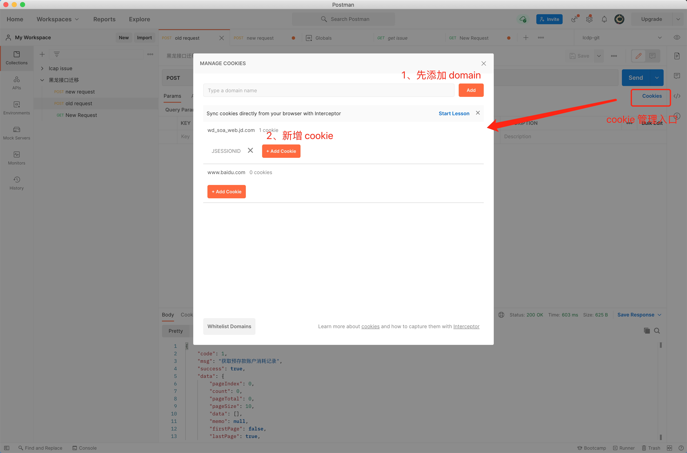

# 环境变量、cookie

## 环境变量

1. 基本操作界面

    

1. 环境变量使用
   
   使用 {{ var }} 引用环境变量
   
    
   
## cookie

   经过 1，2 步骤的配置，当前 domain 的请求都会自动携带新增的 cookie，不需要在 headers 中手动添加

   

## 参考链接

[Postman Doc: Managing environments](https://learning.postman.com/docs/sending-requests/managing-environments/)
