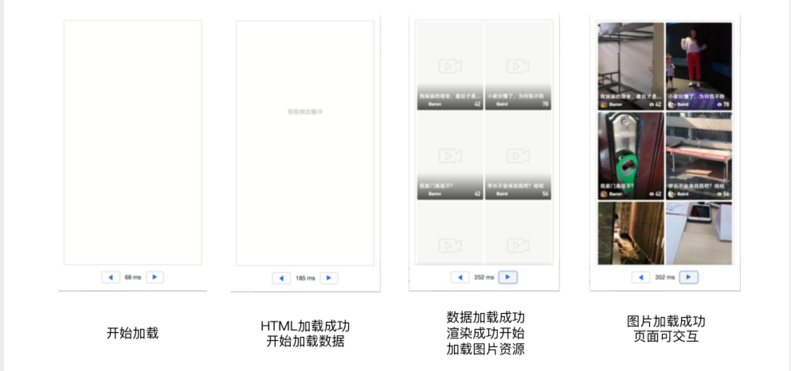
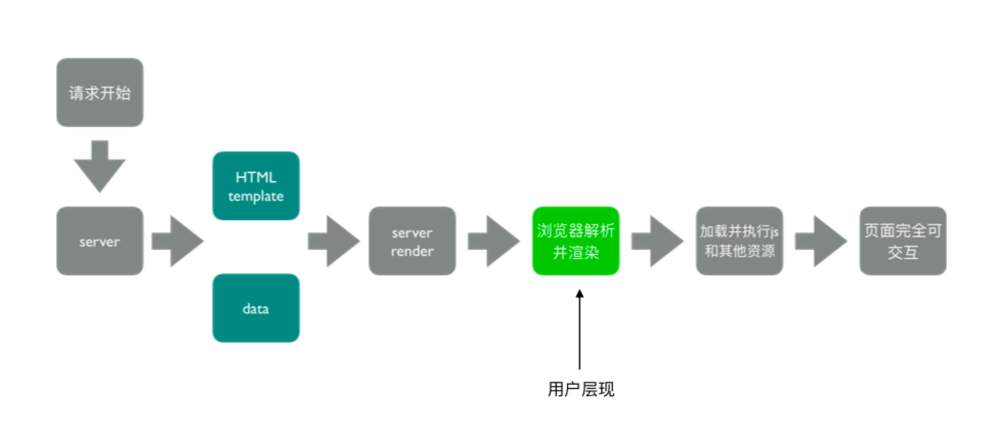

# SSR

## 页面打开过程



1. 开始加载【页面空白】
1. HTML 加载成功开始加载数据【加载中ing】
1. 数据加载成功
1. 渲染成功开始加载图片资源
1.  图片加载成可交互的页面

服务端渲染优化白屏时间

## 服务端渲染（SSR）是什么？

渲染： HTML+ CSS + JS + Data -> 渲染后的 HTML，减少请求数量

服务端：
1.  所有模版等资源都存储在服务端
1.  内网及其拉去数据更快
1.  一个 HTML 返回所有内容

## 浏览器和服务器交互流程



加载并执行 JS 和其他资源，执行懒加载的文件【多屏内容】

## 客户端渲染 VS 服务端渲染
||客户端渲染|服务端渲染|
|:---|:---|:---|
|请求|多个请求（HTML，数据等）|1个请求|
|加载过程|HTML & 数据串行加载|1个请求返回 HTML & 数据|
|渲染|前端渲染|服务端渲染|
|可交互|图片等静态资源加载完成，JS 逻辑执行完成可交互|同客户端渲染|

总结：服务端渲染（SSR）的核心是减少请求

## SSR 的优势

减少白屏时间，对 SEO 友好

## SSR 代码实现思路

### 服务端

1. 使用 react-dom/server 的 renderToString 方法将 React 组件渲染成字符串;解决
    浏览器对象在 node 中不能运行的问题
1. 服务端路由返回对应的模版

```javascript
const express = require('express')
const { renderToString }  = require('react-dom/server')
const SSR = require('./dist/search-server.js') // key code。通过 SSR webpack 打包出的文件
// 文件名称不需要 hash

server(process.env.PORT || 3000)

function server(port) {
  const app = express()
  app.use(express.static('dist'))
  app.get('/search', (res, req) => {
    console.log('Server response template: ', renderToString(SSR))
    res.status(200).send(renderMarkup(renderToString(SSR)))
  })
  
  app.listen(port, () => {
    coonsole.log('server is running on port ', port) 
  })
}

function renderMarkup() {
  return (
    `
    `
  )
}
```

### 客户端

打包出针对服务端的组件

    -- 根据环境变量，打包出针对服务端渲染的组件
    
## window is not defined

处理一个 hack
```javascript
// server/index.js
if (typeof window === 'undefined') {
  global.window = {}
}
```

## webpack ssr 打包存在的问题

### 浏览器的全局变量（Node.js 中没有 document，window）

1. 组件适配：将不兼容的组件根据打包环境进行适配
1. 请求适配：将 fetch 或者ajax 发送请求的写法写成 isomorphic-fetch 或者 axios

### 样式问题（Node.js 无法解析 css）

1. 服务端打包通过 ignore-loader 忽略掉 CSS 的解析
1. 将 style-loader 替换成 isomorphic-style-loader【需要使用 css in js 的写法】

## 如何解决样式不显示的问题？

使用打包出来的浏览器端 html 为模版

设置占位符，动态插入组件

1. 在底部插入一个外链的 CSS

1. 样式直接内联到 CSS

```html
<!DOCTYPE html>
<html lang="en">
<head>
  <meta charset="UTF-8">
  <title>Title</title>
</head>
<body>
  <div id="root"><!--HTML_PLACEHOLDER--></div>
</body>
</html>
```

## 首屏数据如何处理？

1. 服务端获取数据
1. 替换占位符

```html
<!DOCTYPE html>
<html lang="en">
<head>
  <meta charset="UTF-8">
  <title>Title</title>
</head>
<>
<div id="root"><!--HTML_PLACEHOLDER--></div>

<!--INITIAL_DATA_PALCEHOLDER-->
</body>
</html>

```
