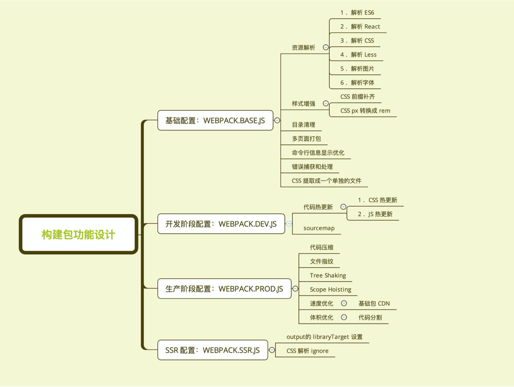

# 功能模块设计和目录结构

## 功能模块设计



## 目录结构设计

```tree
/test // 测试代码
/lib // 源码位置
    webpack.base.js
    webpack.dev.js
    webpack.prod.js
    webpack.ssr.js
README.md
CHANGELOG.md
.eslintrc.js
package.json
index.js
```


备注：
html-webpack-externals-plugin 两年没更新了，有bug，比如多页面时，或导致html中重复引入 <script> 标签，而且看视频中老师编译之前，不仅在 webpack 配置中指定一遍地址，还需要在 html 模板中再写以便。

在该插件的github issues 上，按图索骥，找到了替代方案，朋友们可以试试看，只需要使用 html-webpack-tags-plugin 这个插件（https://github.com/jharris4/html-webpack-tags-plugin），在webpack配置中，HtmlWebpackPlugins 的后面增加如下配置，会和 html-webpack-externals-plugin 插件干的事情类似，插入脚本标签到 html 中，同时自动为 webpack 增加 externals 属性
（文档中有一句：Will add the following properties to the webpack.compilation.options.externals），这个webpack 的 externals 字段就是用来将一些三方 vendors 库从输出文件中去除，我们没有手动配置，是因为了这两个插件背地里自动去做了。

经过上面的讲解，下面该插件为什么这么使用，大概就能明白了吧，具体可以自行查看文档。

现在尝试注释以上的配置，会发现 react 和 react-dom 两个包，又被打包进 index.js 或 search.js 代码中了，说明它们确实做了两件事：
1. 注入 script 标签
2. 在 webpack 编译过程中指定 externals 字段
