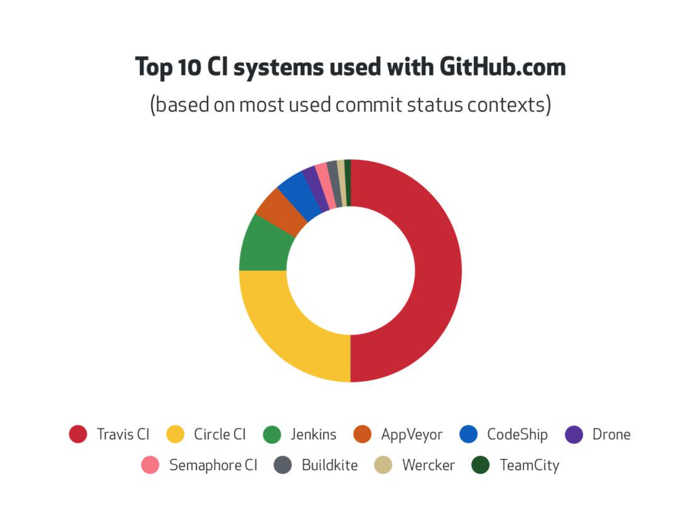

# 持续集成

## 持续集成的作用

优点：
1. 快速发现错误
1. 防止分支大幅偏离主干

核心措施是，代码集成到主干之前，必须通过自动化测试。只要有一个测试用例失败，
就不能集成。

## GitHub 最流行的 CI


## 接入 Travis CI
1. https://travis-ci.org/ 使用 GitHub 账号登录
1. 在 https://travis-ci.org/account/repositories 为项目开启
1. 项目跟目录下新增 .travis.yml

## travis.yml 文件内容
```yaml
language: node_js
sudo: false
cache:
    apt: true
    directorise:
      - node_modules # 缓存 node_modules

node_js: stable

install:
    - npm install -D # 安装构建包依赖
    - cd ./test/template-project
    - npm install -D # 安装项目模板依赖

script:
    - npm test
```
