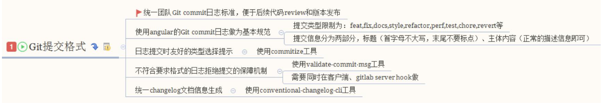

# git commit 规范与changeLog

## 良好的 Git commit 规范优势

1. 加快 Code Review 的流程
1. 根据 Git Commit 的元数据生成 ChangeLog
1. 后续维护者可以知道 Feature 被修改的原因

## 技术方案


## 提交格式要求
```gitexclude
<type>(scopt): <subject>
<BLANK LINE>
<body> # 详述 subject，1，2，3，4
<BLANK LINE>
<footer> # bug 链接；issue 链接
```
type 代表每次提交的类型

|类型|含义|
|:---|:---|
|feat| 新增 feature|
|fix| 修复 bug|
|docs| 仅仅修改了文档，比如 READM, CHANGELOG, COUNTRIBUTE 等等|
|style| 仅仅修改了空格、格式缩进，不改代码逻辑|
|refactor| 代码重构，比如提升性能、体验|
|perf| 优化相关，比如提升性能、体验|
|test| 测试用例，包括单元测试、集成测试等|
|chore| 改变构建流程，或者增加依赖库、工具等|
|revert| 回滚到上一个版本|

## 本地开发阶段增加 precommit 钩子

1. 安装 husky
```bash
npm install husky
```
1. 通过 commitmsg 钩子校验信息
```json
{
  "script": {
    "commitmsg": "validate-commit-msg",
    "changelog": "conventional-changelog -p angular -i CHANGELOG.md -s -r 0"  
  },
  "devDependcies": {
    "validate-commit-msg": "^2.11.1",
    "coonventional-changelog-cli": "^1.2.0",
    "husky": "^0.13.1"
  }
}
```

## https://github.com/commitizen/cz-cli
