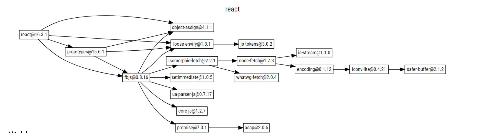

# 语义化版本（Semantic Versioning）规范格式

## 开源项目版本信息案例

1. 软件的版本通常由三位组成。X.Y.Z
1. 版本是严格递增的。React: 16.2.0 -> 16.3.0 -> 16.3.1
1. 在发布重要版本时，可以发布 alpha【内部灰度测试】、beta【外部测试】、rc【公测】
 等先行版本

## 遵守 semver 规范的优势
1. 避免出现循环依赖
1. 依赖冲突减少

## 语义化版本规范格式

主版本号：当你做了不兼容的 API 修改

次版本号： 当你做了向下兼容的功能性新增

修订号： 当你做了向下兼容的问题修正

## 先行版本号

先行版本号可以作为发布正式版之前的版本，格式是在修订版本号后面加上一个连接号(-),
再加上一连串(.)分割的标识符。标识符可以由英文、数字和连接号(a-zA-Z0-9-)组成。

1. alpha 是内部测试版，一般不向外部发布，会有很多 bug。一般只有测试人员使用
1. beta 也是测试版，这个阶段的版本回一直加入新的功能。在 alpha 版后推出
1. rc(release-candidate) 系统平台上就是发行候选版本。RC 不会再加入新的功能，
主要着重于除错。
