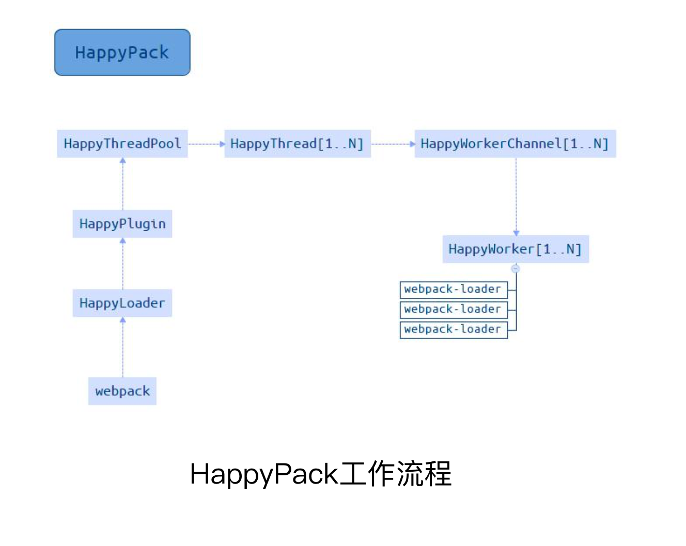

# 多进程/多实例构建

## 多进程/多实例构建：资源并行解析可选方案

thread-loader

parallel-webpack

HappyPack

## HappyPack

webpack 3 使用较多，目前已不再维护

每次 webpack 解析一个模块，HappyPack 会将它及它的依赖分配给 worker 线程中

## thread-loader

每次 webpack 解析一个模块，thread-loader 会将它及它的依赖分配给 worker 线程中
