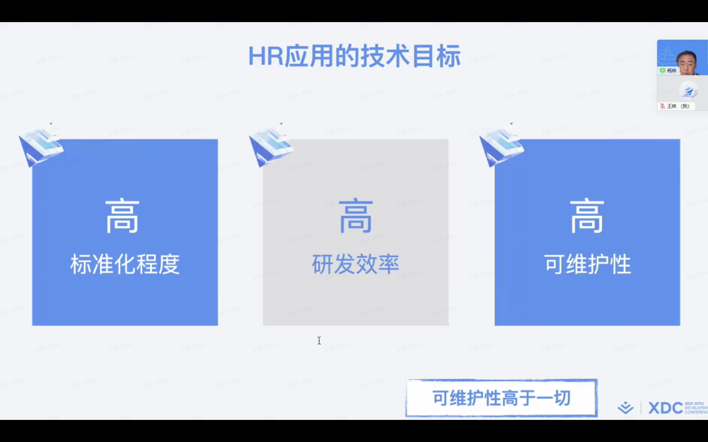
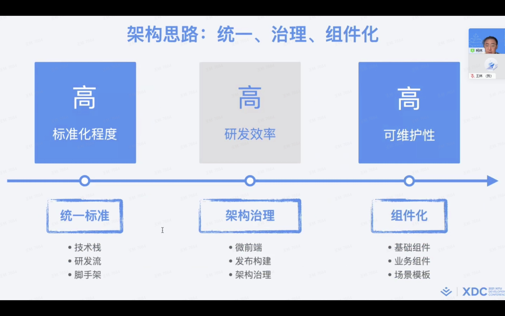

# 美团企业应用前端工程化实践

## 简介

## 首页

## 自我介绍

## 目录

## part 01 企业应用业务特点和挑战

### 什么是企业应用

### HR 业务介绍

### HR 架构演进

### HR 应用分析

### HR 应用业务特点及挑战

### HR 应用的技术目标

### 一套标准 一套体系

## Part 02 企业应用架构实践

### 架构思路：统一、治理、组件化

#### 统一标准：系统早期建设

#### 统一标准：流程、规范统一

#### 统一标准：工具建设

#### 架构治理：微前端的演进和挑战

#### 架构治理：微前端设计

#### 架构治理：独立部署和集成

#### 架构治理：微前端概览

#### 架构治理：微前端实践总结

#### 组件化：组件化设计思路

#### 组件化：三层提效

#### 组件化：组件体系

### 监控度量

### 持续演进

### 未来展望 - 原则

### 企业应用未来展望 - 思路

## 总结

### 关于我们

