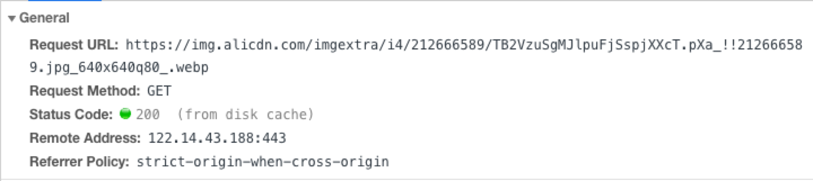
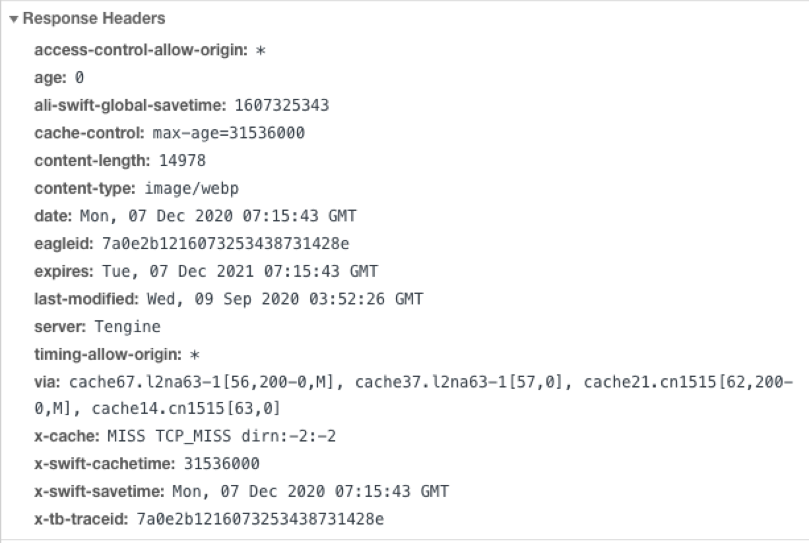
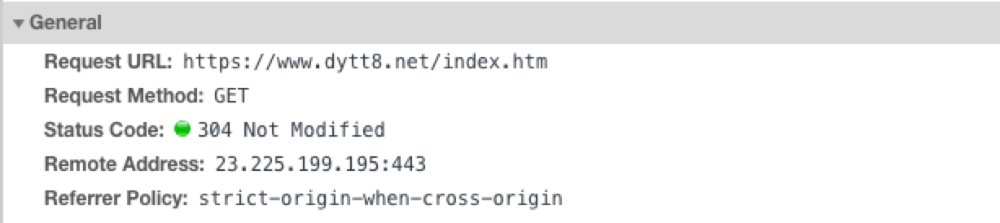
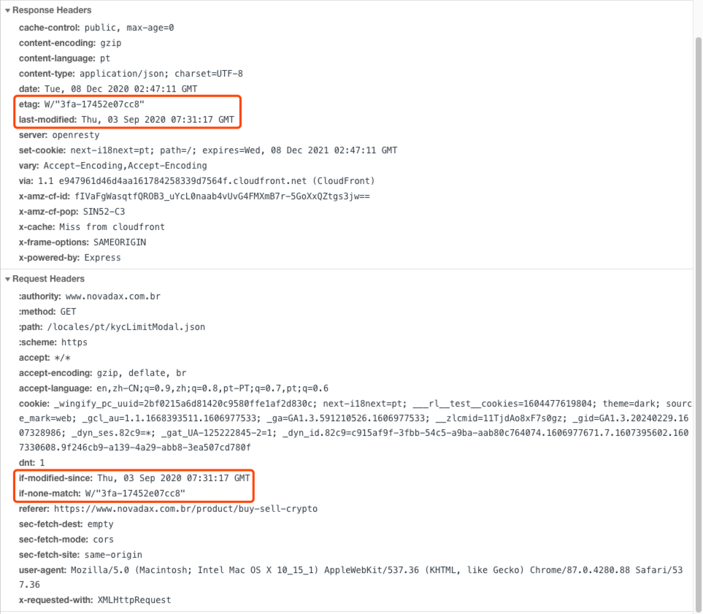

# 浏览器缓存

## 强缓存

1. 实现效果

    不与服务端发生通信
    
    

1. 实现方式
    
    
    
    设置 response 的 Expires 或者 Cache-Control 的两个 response header。  
      
    ||Expires|Cache-Control|
    |:---|:---|:---|
    |http 版本| http 1.0| http 1.1|
    |配置位置| response header| response header|
    |值| http 日期| 固定的指令，不同的指令之间以 "," 分隔。|
    |示例| Expires: Wed, 21 Oct 2015 07:28:00 GMT| Cache-Control: no-store Cache-Control:public, max-age=31536000 Cache-Control: no-cache Cache-Control: max-age=0|
    |判断缓存过期方式| 对比客户端时间与 Expires 时间| 在指令为 max-age=\<seconds\>的情况下，计算请求时间与缓存时间的时间差，再对比 seconds|
    |缺陷|Expires 是服务器返回的一个绝对时间，在 **服务器时间** 与 **客户端时间** 差异较大时，缓存管理容易出现问题。比如随意修改客户端时间。|-|
    |优势|-| 不仅可以在 response header 配置，还可以在 request header 中配置，提供多种指令，且多种指令可以一起使用，配置更加灵活|
    |缓存过程|1、浏览器第一次跟服务器请求一个资源，服务器在返回这个资源的同时，在response的header加上Expires的header 2、浏览器在接收到这个资源后，会把这个资源连同所有的response header一起缓存下来，所以缓存命中的请求返回的header并不是来自服务器，而是来自之前缓存的header 3、浏览器再请求这个资源时，先从缓存中寻找，找到这个资源后，拿出Expires跟当前的请求时间比较，如果请求时间在Expires指定的时间之前，就能命中缓存，否则就不行。 4、如果缓存没有命中，浏览器直接从服务器加载资源时，Expires Header在重新加载的时候会被更新|1、浏览器第一次跟服务器请求一个资源，服务器在返回这个资源的同时，在response的header加上Cache-Control的header 2、浏览器在接收到这个资源的时候，会把这个资源连同所有response header一起缓存下来 3、浏览器再次请求这个资源的时候，先从缓存中寻找，找到这个资源之后，再拿这个过期时间跟当前的请求时间比较，如果请求时间在过期时间之前，就能命中缓存，否则就不行。 4、如果缓存没有命中，浏览器直接从服务器加载资源时，Cache-Control在重新加载的时候会被更新|
    
1. 强缓存的管理

    1. 通过代码的方式，在web服务器返回的响应中添加Expires和Cache-Control Header
    1. 通过配置web服务器的方式，让web服务器在响应资源的时候统一添加Expires和Cache-Control Header
    
1. 强缓存的应用
    
    缓存前端静态资源
    
1. 缓存更新

   修改资源路径。
   
   1.在资源路径中增加资源指纹，每次更新文件，更新指纹，同时更新路径。
       https://www.example.com/static/chunks/8da7c0123e8d232477df3a10fb2a3d3a392cccf7.bf434df6ae7469590ca1.js
   1.在资源路径中增加资源版本。缺点是需要手动更新资源路径。
       https://www.example.com/static/chunks/example.js?version=1.0
       
1. 部署注意事项
    
    1. 用增量更新的方式取代全量更新，防止旧资源 404
    1. 先部署资源再部署页面，防止 404
    
## 协商缓存

1. 实现效果

    与服务器发生通信。
    
    
    
1. 实现方式
    
    
    
    1. Last-Modified、If-Modified-Since
        
        1. 浏览器第一次跟服务器请求一个资源，服务器在返回这个资源时，在response的header加上Last-Modified的header，表示这个资源在服务器上的最后修改时间
        2. 浏览器再次向服务器请求这个资源时，在request的header加上If-Modified-Since的header，这个header的值就是上一次请求时返回的Last-Modified的值
        3. 服务器再次收到资源请求时，根据浏览器传过来If-Modified-Since和资源在服务器上的最后修改时间判断资源是否有变化，如果没有变化则返回304 Not Modified，但是不会返回资源内容，如果有变化就返回资源内容，当服务器返回304 Not Modified的响应时，response header中不会再添加Last-Modified的header，因为资源没有变化，Last-Modified的值也不变
        4. 浏览器收到304的响应后，就会从缓存中加载资源
        5. 如果协商缓存没有命中，浏览器直接从服务器加载资源时，Last-Modofied header在重新加载的时候会被更新，下次请求时，If-Modified-Since会采用上一次返回的Last-Modified的值
        
    这一对header都是根据服务器时间返回的，有时候会有服务器资源有变化，但最后修改时间却没有变化的情况.
    
        1. 我们编辑了文件，但文件的内容没有改变。服务端并不清楚我们是否真正改变了文件，它仍然通过最后编辑时间进行判断。因此这个资源在再次被请求时，会被当做新资源，进而引发一次完整的响应——不该重新请求的时候，也会重新请求。
        1. 当我们修改文件的速度过快时（比如花了 100ms 完成了改动），由于 If-Modified-Since 只能检查到以秒为最小计量单位的时间差，所以它是感知不到这个改动的——该重新请求的时候，反而没有重新请求了。
    
    1. ETag、If-None-Match
    
        1. 浏览器第一次向服务器请求一个资源，服务器在返回这个资源的同时，在response的header加上ETag的header，这个header是服务器根据当前请求的资源生成的一个唯一标识，是一个字符串，只要资源内容发生改变，这个字符串也会改变，跟时间没有关系
        2. 浏览器再次请求这个资源的时候，在request的header上加上If-None-Match的header。这个header的值是上一次请求返回的ETag的值
        3. 服务器再次收到资源请求时，根据客户端传过来的If-None-Match和重新生成的该资源的新的ETag做比较，相同则返回304 Not Modified，不会返回资源内容，如果不同则返回资源内容，但这里即使资源没有发生变化，也会返回ETag，因为这个ETag重新生成过，即使没有ETag没有变化
        4. 浏览器收到304响应后，就从缓存中加载资源
        
1. 协商缓存的管理
    
    一般服务器上的【Last-Modified、If-Modified-Since】和【Etag、If-None-Match】会同时启用，协商缓存需要配合强缓存使用
    
## Service Worker Cache

## Push Cache

参考链接:
1. [浏览器相关原理(面试题)详细总结一](https://juejin.cn/post/6844903962216824839#heading-8)
1. [关于CDN与缓存(浏览器和CDN)](https://www.cnblogs.com/wuguanglin/p/BrowerCache.html)
1. [关于浏览器缓存](https://www.cnblogs.com/blogbyhuer/p/9335257.html)
1. [MDN Expires](https://developer.mozilla.org/zh-CN/docs/Web/HTTP/Headers/Expires)
1. [MDN Cache-Control](https://developer.mozilla.org/zh-CN/docs/Web/HTTP/Headers/Cache-Control)
