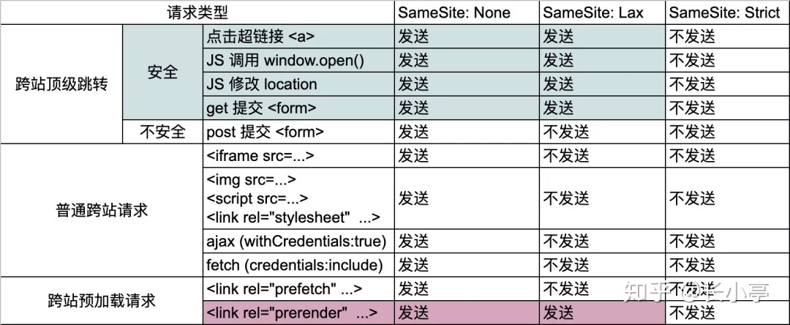

# Cookies

## Cookie 是什么

Cookie 是保存在本地的一个小的文本文件。保存用户信息等。

客户端可以直接读取 cookie，拿到用户信息。

当浏览器发送请求，每次都会自动携带当前域名下的 cookie。正式由于这个原因，不建议在 cookie 当中保存太多的信息，过多的信息会增加网络开销，浪费带宽。

login 接口的 http.response.header.set-cookie 会返回身份验证的 cookie。然后每次请求的话，会在 http.request.header.cookie 位置携带这个 cookie

axios 中，通过 withCredentials 字段设置携带 cookie

## Cookie 的意义

在客户端保存用户状态

http 协议是无状态协议，请求发送到服务端，服务端不能辨识具体是哪个用户。所以，可以在 http reqest.header.cookie 携带保存到 cookies 当中的用户信息。

标识用户，区分哪些用户是黑产用户，哪些是真实用户
    
   * 黑产用户：刷票、薅羊毛、水军
   
## cookie 的缺点

1. 每个特定域名下的 cookie 数量有限制。如果超过最大限制，将会删除原有的 cookie
1. 存储大小有限制，只有 4KB
1. 每次发送请求都会发送到服务端，影响资源获取效率
1. 需要自己封装获取、设置、删除的方法。可以直接使用 [nookies](https://www.npmjs.com/package/nookies) 去实现

## 第三方 Cookie

非当前域名下的 cookie 都为第三方 cookie

### 第三方 Cookie 的用途

1. 前端日志打点
    
    保存监控服务的 cookie。每次请求是，携带这个 cookie 标识用户

1. 广告营销神器 - Facebook Pixel

    追踪，记录用户操作行为

1. mmstat
    
    一个收集用户行为的平台，分析用户行为，实现精准推送
    
## 浏览器策略

|默认禁用| samesite cookie |
|:---|:---|
|Firefox、Safari 禁用第三方 cookie | chrome|

same site 的 3 个属性

| strict| Lax| None|
|:---|:---|:---|
| 最严格防护。阻止浏览器在所有跨站点浏览上下文中将 Cookie 发送到目标站点，即使在遵循常规链接时也是如此|对于允许用户从外部链接到达本站并使用已有会话的网站站，默认的 Lax 值在安全性和可用性之间提供了合理的平衡|浏览器会在同站请求、跨站请求下继续发送 Cookies，不区分大小写。|

### 浏览器关于 cookie 策略更新

1. 旧版浏览器

    如果没有设置 SameSite 属性，默认为 None

1. Chrome 80+ SameSite 默认为 Lax

1. 2022年后， Chrome 将全面禁用第三方 cookie。即使 SameSite 的值为 None

1. samesite=None 的 cookie，被标记为 Secure。只有在 HTTPS 的情况下实用 samesite=None

[Incrementally Better Cookies](https://tools.ietf.org/html/draft-west-cookie-incrementalism-00)

## 当三方 cookie 全面禁止，将会发生什么？

依赖三方 cookie 的功能将会异常

1. 前端日志功能异常
1. 智能广告消失 
1. 无法追踪转化率

    访问产品广告页，会在浏览器中保存一个 cookie，当你下单购买时，会把这个 cookie 传送到服务端，从而分析广告的转化率。
    
## 禁用三方 cookie 的利弊

好处：

对于普通用户来说，个人信息不会被轻易追踪，隐私不会轻易泄漏

坏处：

1. 对于广告商来说，将不再能轻而易举的获取用户的个人信息，隐私等
1. 三方 SDK 不可用，将无法分析转化率等数据

## 三方 cookie 禁用的解决方案

1. 使用一方 cookie 代替三方 cookie。

    修改用户信息的携带位置。从 request.cookie 转移到 request.body 或者 request.query 中
    
    google analytics 将 cookie 信息写入到当前域名下，发送请求时，将 cookie 信息放在 request.body 中。

1. 浏览器指纹

   浏览器指纹是一种通过浏览器对网站可见的配置和设置信息来跟踪 web 浏览器的方法，浏览器指纹就像我们人手上的指纹一样，具有个体识别度，只不过现阶段浏览器指纹识别的是浏览器。
   
   单独获取浏览器指纹并没有太大意义。通过浏览器指纹计算出一个唯一值，并把这个唯一值作为 key 来记录用户的操作行为，然后向用户精准推送相关内容才是关键。

    1. 浏览器指纹版本
    
        * 1.0 主要集中在用户的 cookie 和 evercookie 上，需要用户登录才可以得到有效的信息
        * 2.0 通过不断增加浏览器的特征值从而让用户更具有区分度，例如 UA，浏览器插件信息
        * 3.0 通过收集用户行为、习惯来为用户建立特征值甚至模型，可以实现真正的追踪技术，这部分实现比较复杂，依然在探索中
        
        目前处于 2.5 代，是因为现在还未解决跨浏览器指纹识别的问题。
    
    1. 指纹采集
    
        * 普通指纹 http.request.headers
        * 高级指纹
            1. javascript attributes
            
            1. CSS
            
                媒体查询获取浏览器屏幕宽度等
            
            1. Canvas 指纹
            
                使用 Canvas 绘制相同的元素，犹豫系统的差别、字体渲染引擎的不同、对抗锯齿、次像素渲染算法的不同，Canvas 得到的结果不同
                
                在画布上渲染一些文字，然后 toDataURL 转换出来，即便开启了隐私模式一样可以得到相同的值
                
            1. AudioContex指纹
                
                AudioContext指纹和Canvas类似也是基于硬件设备或者软件的差别，来产生不同的音频输出，然后计算得到不同的hash来作为标志，当然这里的音频并没有直接在浏览器中播放出来，只需要拿到播放前的处理数据就行
                
            1. WebGL
            
            1. WebRTC
            
                通信 Ip
                
            1. UUID
            
                [clientjs](https://github.com/jackspirou/clientjs)     
            
            1. 跨浏览器指纹
            
                跨浏览器指纹就是即便是在不同浏览器上也可以取得相同或者近似值的稳定浏览器特征。
            
    1. 如何防范浏览器指纹
    
        * 泄漏的隐私非常片面，只能说泄漏了用户部分浏览网页时的行为
        * 价值不够，用户行为并未将实际账户或者具体的人对应起来，产的价值有限
        * 利用浏览器指纹可以隔离部分黑产用户，防止刷票或者部分恶意行为
        
        1. Do Not Track
        
            在 http.request.header 增加 DNT 字段。1 标识不要追踪我的网页，0 表示可以追踪
            
            可以通过 **navigator.doNotTrack** 获取当前的追踪状态
            
            但是，大多数网站并未遵守这个约定。
            
            使用 Privacy Badger 浏览器广告拦截插件
        
        1.  Tor Browser (一个新的浏览器)
        
            浏览器指纹的原理是通过获取浏览器特征，然后计算出唯一 ID，标识用户。浏览器特征越多，标识的用户越精确。
            
            Tor 浏览器在这方面做了很多工作，来阻止浏览器指纹。甚至可以主动阻止 JS

        1. 禁用 JS
        
            禁用 JS 能够非常有效的防御浏览器指纹追踪，但是会导致网站原有的功能不可用。

            这个也不是非常有效，可以通过 CSS 来获取用户的相关信息，例如：媒体查询获取用户的显示器宽度。有些 CSS 曾经可以直接查询 Windows 系统信息


## Cookie API

```js
// 创建 cookie
// 默认路径 '/'， 默认过期时间 session[关闭浏览器，清除 cookie]
// 只能读取非 HttpOnly 类型放入 cookie
document.cookie="username=John Doe";

// 使用 expires 参数设置 cookie 过期时间[以 UTC 或 GMT 时间]。默认关闭浏览器时删除
// new Date().toGMTString()或者 new Date().toUTCString()
// 如果未设计 expires，这样的 cookie 称为会话 cookie，保存在内存中，会话结束，也就是浏览器关闭时，cookie 消失
// Expires是 http/1.0协议中的选项，在http/1.1协议中Expires已经由 Max age 选项代替，两者的作用都是限制
// cookie 的有效时间。Expires的值是一个时间点（cookie失效时刻= Expires），而Max age的值是一个以秒为单位
// 时间段（cookie失效时刻= 创建时刻+ Max age）。 另外， Max age的默认值是 -1(即有效期为 session )；
// Max age有三种可能值：负数、0、正数。负数：有效期session；0：删除cookie；正数：有效期为创建时刻+ Max age
document.cookie="username=John Doe; expires=Thu, 18 Dec 2043 12:00:00 GMT"; 

// 使用 path 参数设置 cookie 目录。默认为：/，默认为根目录
// 如果 cookie 的 path = '/'，那么所有 request.header.cookie 都会携带这个 cookie
// 如果 cookie 的 path 为特定的路径，那么在特定的路径下，request.header.cookie 才会携带这个cookie
// 所有路径都会携带 'username=John Doe'
document.cookie="username=John Doe; expires=Thu, 18 Dec 2043 12:00:00 GMT; path=/";
// 只有 /^\/login\//.test(request.url) 的时候才会携带 'username=John Doe login'
document.cookie="username=John Doe login; expires=Thu, 18 Dec 2043 12:00:00 GMT; path=/login";

// 使用 domain 参数设置 cookie 的域名[这个尝试了很多次，没有成功]
// 浏览器会将domain和path都相同的cookie保存在一个文件里，cookie间用*隔开
document.cookie="username=John Doe login; expires=Thu, 18 Dec 2043 12:00:00 GMT;domain=taobao.com; path=/login;";
document.cookie="username=John Doe login; expires=Thu, 18 Dec 2043 12:00:00 GMT;domain=sub.taobao.com; path=/login;";

// 读取 cookie
// 可以读取当前域名下的所有 cookie
var cookie = document.cookie // cookie = 'cookie1=value; cookie2=value; cookie3=value;'

// 修改 cookie
// 当 name，domain，path 这 3 个字段都相同的时候，cookie 才会被覆盖
document.cookie=`${cookie.key}=${newValue}`

// httpOnly: 这个选项用来设置cookie是否能通过 js 去访问
// 当cookie带httpOnly选项时，客户端则无法通过js代码去访问（包括读取、修改、删除等）这个cookie。

```

## SameSite

### 含义

有效顶级域名（eTLD, effective top-level domain）[PUBLIC SUFFIX LIST](https://publicsuffix.org/) 。包含两部分的内容

1. 一部分是由域名注册机构提供的顶级域名（例如: .com .net 等）和部分二级域名（例如: .gov.uk .com.br 等）
1. 另一部分是有个人或机构提供的私有域名，例如: github.io  computer.amazionaws.com 等

SameSite 里的 site 指的是 eTLD+1，即：有效顶级域名再加它的下一级域名

||site|eLTD| eLTD+1|
|:---|:---|:---|:---|
|qzone.qq.com| qq.com|.com| qq.com|
|vip.qzone.qq.com| qq.com|.com|qq.com|
|bootstrap.github.io|bootstrap.github.io|github.io|bootstrap.github.io|

### same-site request VS cross-site request

一个 HTML 页面既可以发起同站请求，也可以发起跨站请求。当请求目标的 URL 对应的 site 与页面所在 URL 对一个的 site 相同时，这个请求就是
同站请求，反之就是跨站请求。

|page url| request url| is cross site|
|:---|:---|:---|
|baidu.com| static.baidu.com| same site|
|a.gihub.io| b.github.io| cross site|

同源 = 同协议、同域名、同端口。

同源一定同站，同站不一定同源（www.baidu.com 和 static.baidu.com）。

### 属性值

|None|Lax|Strict|
|:---|:---|:---|
|同站求情和跨站强求都会携带此 cookie|同站请求会携带此 cookie，特殊情况的跨站请求也会携带此 cookie<br/>safe corss-site top-level navigatios(安全的跨站顶级跳转):<br/>点击超链接\<a\> 产生的请求<br/>以GET 方式提交表单产生的请求<br/>JS 修改 location 对象产生的跳转<br/>JS 调用 widow.open() 等方式产生的跳转请求|只有同站请求会携带此 cookie|

```bash
// http header
Set-Cookie: sessionId=F123ABCA; SameSite=Strict; secure; httponly;
// js
document.cookie= "sessionId=F123ABCA; SameSite=Strict; secure;"
```

不同方式的跨站请求



[specify prerender processing model](https://github.com/w3c/resource-hints/issues/63)

参考位置：[关于 cookie samesite 的困惑](/翻译/cookie-samesite.md)

## 参考链接

1. [浏览器指纹追踪技术简述](https://zhuanlan.zhihu.com/p/94158920)
1. [当浏览器全面禁用三方 Cookie](https://juejin.cn/post/6844904128557105166)
1. [cookie中的path与domain属性详解](https://blog.csdn.net/andyzhaojianhui/article/details/79071747)
1. [cookie MDN 文档](https://developer.mozilla.org/zh-CN/docs/Web/API/Document/cookie)
1. [一文带你看懂cookie，面试前端不用愁](https://zhuanlan.zhihu.com/p/52091630)
1. [CSRF 漏洞的末日？关于 Cookie SameSite 那些你不得不知道的事
](https://zhuanlan.zhihu.com/p/137408482)
