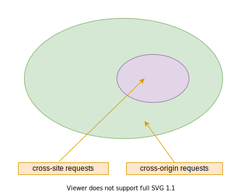

# 关于 cookie samesite(同站属性) 的困惑

原文地址：[The great SameSite confusion](https://jub0bs.com/posts/2021-01-29-great-samesite-confusion/)

在这篇文章中，我剖析了一个关于 cookie samesite 属性常见的误解，并探讨了它对 web 安全性的潜在影响。

* cookie samesite 的属性是不太好理解的
* 合并 site 和 origin(源) 是常见的，但是是一个有害的错误
* site 的概念比表象上看起来的更加难以捉摸
* 一些请求是 cross-origin(跨域) 的，但是却是 same-site(同站)
* samesite 只关心 corss-site(跨站) 请求
* samesite 在你的子域名后面画了个一目标
* 被误导的开发者可能会过度回避 SameSite=Strict

## SameSite 的由来

你肯定听说过 cookie 的 SameSite 属性。在 2020年，Chrome 开始修改 SameSite 的默认行为，Firefox 在随后几个月也开始[效仿](https://hacks.mozilla.org/2020/08/changes-to-samesite-cookie-behavior/)。

SameSite 是一种针对跨站攻击的深度防御机制，比如 [CSRF](https://owasp.org/www-community/attacks/csrf) 和 [XSS](https://www.scip.ch/en/?labs.20160414)。自 2016 年问世以来，SameSite 一直处于浏览器的核心位置。

SameSite 在 2020 年初被激活，需要一些网站手动的调整以保持第三方授权。但被广泛称赞为浏览器防御的一个受欢迎的新增功能。处于对 SameSite 在浏览器中激活的预期和反应，博客上开始出现关于**新 cookie**的帖子。

## 关于这些博客的评价

其中一些帖子的精确度令人钦佩，比如 Rowan Merewood 的 [SameSite cookies explained](https://web.dev/samesite-cookies-explained/)。遗憾的是，关于 SameSite 的帖子很少能解析清楚站点的概念，而**同一站点请求**和**跨站请求**都是从这个概念中衍生出来的。

此外，许多帖子，包括那些由信息安全社区有影响力的成员制作的帖子，似乎可以将 origin 和 site 这两个术语互换。

下面是节选的部分印象**比较深刻**的博客：

1. 在 2019 年 2 月，Kristian Bremberg 在他的博客 [A guide to HTTP security headers for better web browser security](https://blog.detectify.com/2019/02/05/guide-http-security-headers-for-better-web-browser-security/) 中写道：

    > SameSite 属性是相当的新，并且提供了对 CSRF 的保护。如果一个 cookie 使用了 SameSite 属性，web 浏览器将确保使用 cookie 发出的请求来自 cookie 的来源。

1. 信息安全巨星 Troy Hun 本人在博客 [Promiscuous Cookies and Their Impending Death via the SameSite Policy](https://www.troyhunt.com/promiscuous-cookies-and-their-impending-death-via-the-samesite-policy/) 中描述了不同的 SameSite 属性值的效果。

    >  1. None: Chrome 的默认值。<br/>2. Lax: 在 **cross-origin(跨域)** 请求的时候携带有限的 cookie<br/>3. Strict:在 **cross-origin(跨域)** 请求的时候严格限制 cookie 的携带

1. 几个月之后，Reconless 团队在一片精彩的文章 [Samesite by Default and What It Means for Bug Bounty Hunters](https://blog.reconless.com/samesite-by-default/) 中分析了 SameSite 的出现是如何影响黑客们所珍视的一些列漏洞。

    > 更新之后，所有没有显示设置 SameSite 属性的值，都当 SameSite=Lax 对待。这意味着，除了顶级导航外 **cross-origin(跨域)** 请求将不再携带 cookie

Domain(域名)、 host(主机)、 origin(源)、 site(网站) 在非正式的交流中随意使用这些术语是很自然的，在这样的使用环境中也是可以原谅的。

## site 与 origin 是否可以互换？

SameSite 属性的出现，引出了以下的一些问题：

1. 在这里，仔细的区分 site 和 origin 是否有必要？
1. 这仅仅是一个没有区别的区别吗？
1. 一个 cross-origin 请求是否与 cross-origin 请求不同？
1. cookie 的 SameSite 属性也可以命名为 SameOrigin 吗？
1. site 和 origin 之间真正的区别是什么？他们对使用者重要吗？
1. 如果他们之间有区别，应该怎么做？

你或许已经从这篇文章的标题猜到了答案：site 在 SameSite 的上下文当中具有非常专业的含义，但是他被不恰当的忽略了。site 和 origin 之间的区别也很重要，但是这两个概念经常被混为一谈。

并不是每个人都忽略了这个术语上的失误。在 Chrome 激活 samesite 的几个月之后，Google 的 web 开发者 Eiji Kitamura 发表了一篇文章 [Understanding "same-site" and "same-origin"](https://web.dev/same-site-same-origin/) 描述 site 和 origin 之间的区别。

## 我们所说的 origin 是什么意思？

如果你使用 web 技术，你至少听说过 [Same-Origin Policy (SOP 浏览器的同源策略)](https://developer.mozilla.org/zh-CN/docs/Web/Security/Same-origin_policy) ，可以说是 web 安全最主要的支柱之一。URI 的概念是 SOP 的核心，并且他也是相当好的理解。定义如下：

   > 粗略说，两个 URI 具有相同的 origin(表示相同的主体)，即他们具有相同的scheme(命名结构)、protocols(协议)、host(主机)、port(端口)

   > URI Scheme: <scheme name> : <hierarchical part> [ ? \<query\> ] [ # \<fragment\> ]

端口是可以配置的，http 默认 80，https 默认 443。

## 我们所说的 site 是什么意思？

在令人痛苦的 site 术语背后，隐藏这一个比 origin 更难理解的概念。首先，site 术语并不是一个技术术语，它早于 SOP 并且在跨站脚本攻击的之前就已经广泛使用了。此外，site 的现代概念充满了技术困难。它与主机注册的域名紧密相连，下面是域名注册标准：

   > 一个域名由最具体的公共后缀构成，如果有的话，前面的域标签也可以。

主机的注册域名也可以称为 eLTD+1(effective top-level domain plus one)

Tips：

域名级数是指一个域名由多少级组成，域名的各个级别被“.”分开，最右边的那个词称为顶级域名。

1. 顶级域名，又称一级域名，常见的有".com"、".org"、".net"、".cn"等。
1. 二级域名就是在一级域名前再加一级，如"baidu.com"。
1. 二级域名以上级别的域名，统称为子域名，不在“注册域名”的范畴中。
1. 根据ICANN说法，过一两年组织可以申请注册顶级域名。
个人可以申请注册二级域名。


在最简单的情况下，一个 origin 的 site 可以简单等效于 host 的**注册域名**。

下面是两个例子：

1. https://www.example.org 的 site 是 example.org，因为 org 是主机的最具体的公开后缀。因此 example.org 是主机的的 eTLD+1。
1. https://jub0bs.github.io 的 site 是 jub0bs.github.io，以为 github.io 是主机的最具体的公开后缀，因此 jub0bs.github.io 是主机的 eTLD+1。

然而，值得注意的的是，注册域名的是一个动态的概念。因为它依赖于 Mozilla 维护的公共后缀列表 [Public-Suffix List](https://publicsuffix.org/list/) 。 这个列表不是已成不变的，而是随着时间的改变而改变的。更不用说，不同的浏览器不必和公共后缀列表保持同步。

在技术细节上，正如 [web.dev](https://web.dev/schemeful-samesite/) 警告的那样，site 的概念仍旧一直在变化，并且也会包含这个方案。这个改变在 Chrome 的后面将很快推出。然而，为了回避这个困难并延伸这篇文章的相关性，我只考虑 origin 的 scheme 是 https。 

## same-site vs cross-site request

现在我们已经理清你了 site 的概念，接下来我们将讨论 same-site 和 cross-site request。两者的不同取决于  request's origin 和 target origin 之间的比较。

如果两个 origin 是相同的，那么就是 same-site reques；如果两个 origin 不同，那就是 cross-site request。

|request origin| target origin||
|:---|:---|:---|
|https://foo.example.org|https://bar.example.org| same-site|
|https://foo.github.io|https://bar.github.io| cross-site|
|https://foo.bar.example.org|https://bar.example.org| same-site|

## cross-origin 、same-site requests

显而易见，所有的 cross-site 请求都是 cross-origin。但是并非所有的 cross-origin 请求都是 corss-site 请求，例如上面的1和3。



cookie.Samesite 属性仅仅关注 cross-site requests，对发生在 same-site 上的 cross-origin request 没有影响。这就是为什么 origin 与 site 之间的区别是很重要的原因。

## Demo

* [https://jub0bs.github.io/samesitedemo-attacker-foiled](https://jub0bs.github.io/samesitedemo-attacker-foiled)
* [https://samesitedemo-attacker.jub0bs.com/](https://samesitedemo-attacker.jub0bs.com/)

这两个页面，都包含一个 [https://samesitedemo.jub0bs.com/readcookie](https://samesitedemo.jub0bs.com/readcookie) 的链接

1. set-cookie 访问 [https://samesitedemo.jub0bs.com/setcookie](https://samesitedemo.jub0bs.com/setcookie) 然后查看 applicatio.cookies 会看到
    
    ```
    'Set-Cookie: StrictCookie=foo; Path=/; Max-Age=3600; SameSite=Strict'
    ```
   
1. 访问 [https://jub0bs.github.io/samesitedemo-attacker-foiled](https://jub0bs.github.io/samesitedemo-attacker-foiled) 的页面链接，因为 https://jub0bs.github.io 的二级域名和 https://samesitedemo.jub0bs.com 的二级域名不一样，所以浏览器不会将 cookie 自动添加到 https://samesitedemo.jub0bs.com/readcookie 的 header，页面也没有打印 StrictCookie。 SameSite=Strict 生效，攻击被阻止。

1. 访问 [https://samesitedemo.jub0bs.com/](https://samesitedemo-attacker.jub0bs.com/) 的页面链接，因为二级域名一样，都是 jub0bs.com，浏览器自动将 cookie 添加到了 request.header，页面正常打印了 'StrictCookie=foo'。
