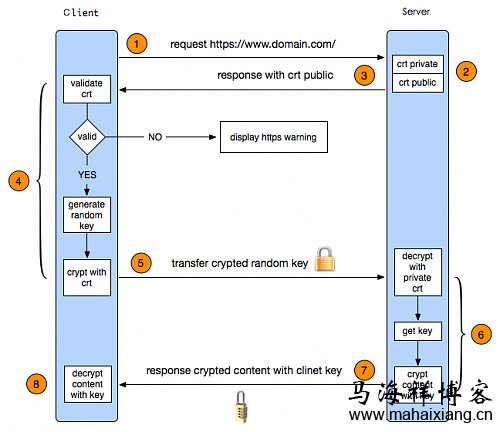

# http VS https

## 什么是 HTTP 协议

HTTP 协议是**超文本传输协议**的缩写，Hyper Text Transfer ProtoCol。他是从 WEB 服务器传输超文本
标记语言（HTML）到本地浏览器的传送协议。

设计 HTTP 最初的目的是为了提供一种发布和接收 HTML 页面的方法。

HTTP 有多个版本，目前广泛使用的是 HTTP/1.1 版本。

## HTTP 的原理

HTTP 是基于 TCP/IP 通信协议来传递数据的协议，传输的数据类型为 HTML文件、图片文件、查询结果等。

HTTP 协议一般用于 B/S 架构。浏览器作为 HTTP 客户端通过 URL 想 HTTP 服务端即 web 服务器发送所有请求。

## HTTP 特点

* HTTP 协议支持 B/S 模式，也是一种 请求/响应 模式的协议
* 简单快速：客户端向服务端请求服务时，只需传送请求方法和路径，常用的请求方法：GET、POST
* 灵活：HTTP 允许传送任意类型的数据对象。传输类型由 Content-Type 加以标记
* 无连接：限制每次链接只处理一个请求。服务器处理完请求，并收到客户端应答后，即断开链接。这样做不利于客户端和服务端保持会话连接。为了弥补这种不足，产生了两项记录 HTTP 状态的技术，一个叫做 Cookie，一个叫做 Session
* 无状态：协议对于事务处理没有记忆，后续处理需要前面的信息，则必须重传。

## TCP 的 3 次握手

1. 建立连接时，客户端发送 syn （syn=j）包到服务器，并进入 SYN_SEND 状态，等待服务器确认
1. 服务器收到 syn 包，必须确认客户的 syn（ack=j+1），同时自己也发送一个 SYN 包（syn=k），即 SYN+ACK 包，此时服务器进入 SYN_RECV 状态
1. 客户端收到服务器的 SYN + ACK 包，向服务器发送确认包 ACK（ack=k+1），此包发送完毕，客户端和服务器进入 ESTABLISHED 状态，完成三次握手，开始传送数据。

三次握手的意义：规避网络传输当中由于延迟而导致服务器开销的一些问题。

## HTTP 的问题

* 请求信息明文传输，容易被窃听截取
* 数据的完整性未校验，容易被篡改
* 没有验证对方的身份，存在冒充危险

## 什么是 HTTPS

HTTPS 是以安全为目标的 HTTP 通道，简单讲是 HTTP 的安全版，即 HTTP 下加入 SSL 层。HTTPS 的安全基础设施是 SSL，因此加密的详细内容就需要 SSL。

HTTPS 的协议主要作用分为两种：

1. 建立一个信息安全通道，来保证网站的真实性
1. 确认网站的真实性

HTTPS = HTTP + SSL/TLS。通过 SSL 证书来验证服务器的身份，并为浏览器和服务器之间的通信进行加密。

SSL(Secure Socket Layer, 安全层套接字)：1994 年为 Netscape 所研发，SSL 协议位于 TCP/IP 协议和各种应用层协议之间，为数据通讯提供安全支持。

TLS(Transport Layer Security, 传输安全层)： 其前身是 SSL，它最初的几个版本 1.0, 2.0, 3.0 由 Netscape 公司开发。1999 年从 3.1 开始被 IETF 标准化并改名。

## HTTPS 工作原理

|图示1| 图示2|
|:---|:---|
|||

1. 首先客户端通过 URL 访问服务器建立 SSL 连接
    
    客户端发起 HTTPS 请求

1. 传送证书

    服务接收到客户端请求后，会将网站支持的证书信息（证书中包含公钥）传送一份给客户端

    采用 HTTPS 的服务器必须要有一套数字证书，可以自己制作，也可以向组织申请。如果是自己制作的证书，需要客户端验证通过，才可以继续访问；而使用授信公司申请的证书则不会弹出提示页面。startssl 的证书有1年的免费服务。
    
1. 客户端解析证书

    这部分工作是由客户端的 TLS 来完成的，首先会验证公钥是否有效，比如颁发机构，过期时间等等，如果发现异常，则会弹出一个警告框，提示证书存在问题。
    
    如果证书没有问题，那么就生成一个随机值，然后用证书对随机值进行加密。

    客户端的服务器开始协商 SSL 连接安全等级，也就是信息加密等级？

1. 传送加密信息

    这部分传送的是用证书加密后的随机值，目的就是让服务器得到这个随机值，以后客户端和服务端的通信就可以通过这个随机值来进行加密解密了。

    客户端的浏览器根据双方同意的安全等级，建立会话密钥，然后利用网站的公钥将会话密钥加密，并传送给服务器

1. 服务器利用自己的私钥解密出会话密钥

    服务端用私钥解密后，得到了客户端传过来的随机值【私钥】，然后把内容通过该值进行对称加密。
    
    所谓对称加密，就是将信息和私钥通过某种算法混合在一起。这样除非知道私钥，不然无法获取内容。而正好客户端和服务端都知道这个私钥，所以只要加密算法够彪悍，私钥够复杂，数据就够安全。

1. 服务器利用密钥加密与客户端之间的通信

1. 客户端解密信息

    客户端用之前生成的私钥解密服务端传过来的信息，于是获取了解密后的内容。

## 搜索引擎对 HTTPS 的态度

1. 谷歌

    Google 在 HTTPS 站点的收录问题上与对 HTTP 站点态度并无什么不同之处。甚至把"是否使用安全加密 HTTPS"作为排名算法中的一个参考要素，采用 HTTPS 加密技术的网站得到更多展示机会，排名相对同类网站的 HTTP 站点更有优势。

1. baidu

    不主动抓取 HTTPS 网页【暂时】。

## HTTPS 的优缺点

|优点|缺点|
|:---|:---|
|SEO：在 Google 的搜索结果中，有更高的排名|HTTPS 协议多次握手，导致页面的家在时间延长，延长近 50%，增加10%到20%的耗电【CM CoNEXT数据】|
|使用 HTTPS 协议可认证用户和服务器，确保数据发送到正确的客户端和服务端|加密范围比较有限，在黑客攻击、拒绝服务攻击、服务器劫持等方面几乎起不到作用|
|防止数据在传输过程中被窃取、改变，确保数据的完整性|SSL 证书的信用链体系并不安全，特别是在某些国家可以控制 CA 根证书的情况下，中间人攻击一样可行|
|虽然不是现行架构下绝对安全的解决方案，但它大幅增加了中间人攻击成本| 申请 SSL 证书需要钱，功能越强大的证书费用越高，个人网站和小网站没有必要，一般不会用|
||SSL 证书通常需要绑定 IP，不能在同一 IP 上绑定多个域名，IPv4 资源不可能支撑这个消耗（SSL 有扩展可以部分解决这个问题，但是比较麻烦，而且要求浏览器、操作系统支持，windows xp 就不支持这个扩展）|
||HTTPS 连接缓存不如 HTTP 高效，大流量万丈如非必要也不会采用，流量成本太高|
||连接服务器占用资源高很多【SSL 安全算法的加密解密】|
||握手阶段比较费时，对网站的响应速度有负面影响|

## HTTPS 使用场景

电子商务、金融、社交网络最好使用 HTTPS 协议

博客站点、宣传类网站、分类信息网站、新闻类网站不太推荐 HTTPS

## 总结 HTTPS 和 HTTP 的区别

||HTTP|HTTPS|
|:---|:---|:---|
|传输内容| 明文，不安全| SSL/TLS 加密，安全|
|默认端口| 80| 443|
|服务器资源| HTTP + TCP + IP| HTTP + （SSL｜ TLS）+ TCP +  IP|
|包数量| TCP 3 个包 | TCP 3 个包 + SSL 握手 9 个包|

参考链接

* [知乎-十分钟搞懂HTTP和HTTPS协议？](https://zhuanlan.zhihu.com/p/72616216)
* [CSDN-面试常考点：http和https的区别与联系](https://blog.csdn.net/xionghuixionghui/article/details/68569282#:~:text=HTTPS%E5%92%8CHTTP%E7%9A%84%E5%8C%BA%E5%88%AB,80%EF%BC%8C%E5%90%8E%E8%80%85%E6%98%AF443%E3%80%82)
* [What Is the Difference Between HTTP and HTTPS?](https://www.keycdn.com/blog/difference-between-http-and-https#:~:text=HTTP%20is%20unsecured%20while%20HTTPS,HTTPS%20operates%20at%20transport%20layer.&text=No%20encryption%20in%20HTTP%2C%20with,data%20is%20encrypted%20before%20sending.)
