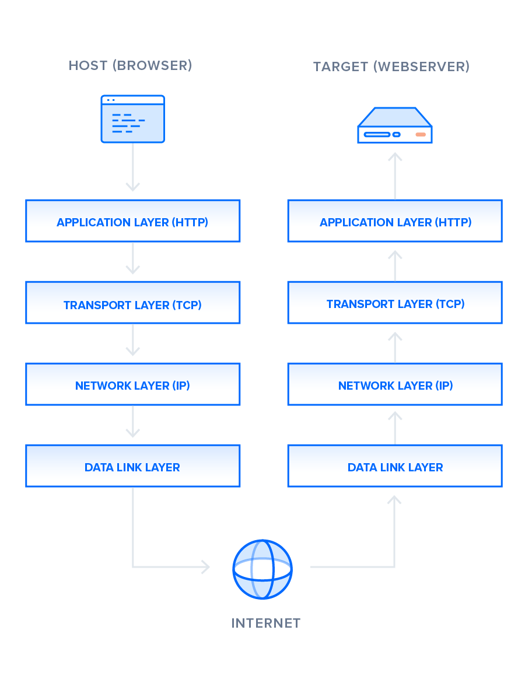
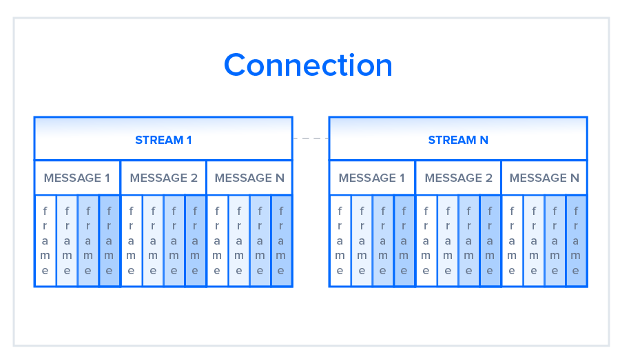
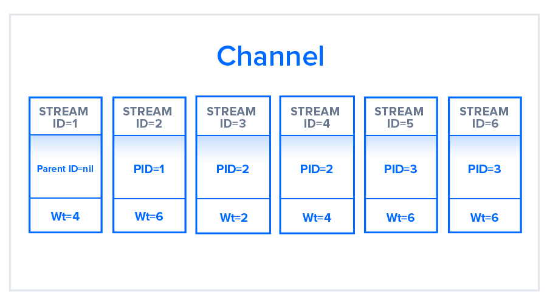
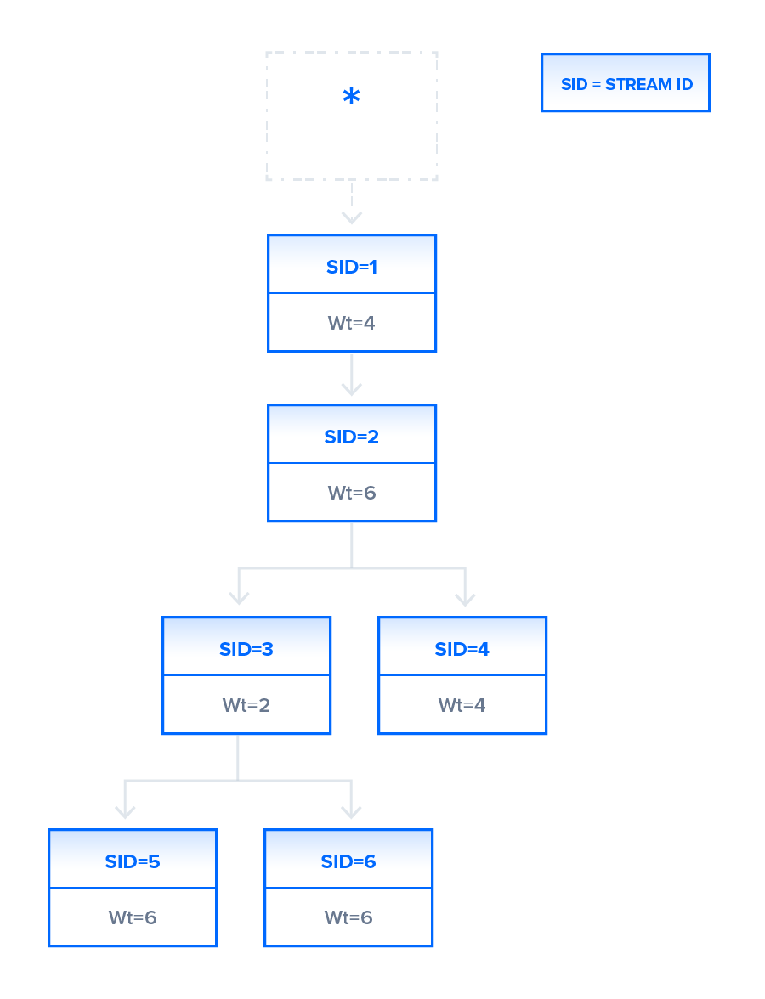

# http 1.1 VS http 2

## 引言

超文本传输协议(HTTP)是一种应用协议，自 1989 年发明以来一直是万维网上通信的行业标准协议。从 1997 年发布到最近，对该协议的修订很少。但在 2015年，一个名为 HTTP/2 的重新设计版投入使用，它提供了几种减少延迟的方法，尤其是在处理移动平台和服务器密集型图形和视频是。从那以后，HTTP/2 变得越来越流行，据估计，世界上大约有 1/3 的网站支持它。在这种不断变化的环境中，web 开发人员可以从理解 HTTP/1.1 和 HTTP/2 之间的技术差异中获益，使他们能够就不断发展的最佳实践作出知情和有效的决策。

在阅读本文之后，将理解 HTTP/1.1 和 HTTP/2 之间的主要区别，重点关注 HTTP/2 为实现高效 Web 协议而采用的技术变化。

## 背景

在详细解释 HTTP/2 对 HTTP/1.1 的改变之前，先纵观下 HTTP 的发展历史和工作原理。

### HTTP/1.1

由 Timothy Berners-Lee 与 1989 年开发，作为万维网的通信标准。HTTP 是一个顶级的应用程序协议，用于在客户端计算机和本地或远程 Web 服务器之间交换信息。在此过程中，客户端通过 GET 或 POST 之类的方法向服务器发送基于文本的请求。作为响应，服务器将一个资源 (如 HTML) 返回给客户端。

例如，假设您正在访问一个域名为 www.github.com 的网站。当你在浏览器地址栏输入这个地址时，回车，浏览器将会发送一个基于文本形式的 HTTP 请求，类似于:

```bash
GET /index.html HTTP/1.1
Host: www.github.com
```

此请求使用 GET 方法，该方法请求来自 Host 之后列出的主机服务器的数据。为了响应这个请求 www.github.com 向客户端返回一个 HTML 页面，除此之外还有 HTML 中调用的任何图像、样式表或其他资源。并非所有的资源都在第一次调用数据时返回给客户端。请求和响应将会在客户端和服务端之间来回传递，直到 Web 浏览器已经收到了在屏幕上呈现 HTML 页面内容所需要的所有资源。

你可以把这种求情和响应的交换看作是互联网协议栈的单一应用层，位于传输层（通常使用传输控制协议或 TCP）和网络层（使用互联网协议或 IP）之上。



关于这个堆栈的底层有很多讨论，但是为了获得对 HTTP/2 的高层理解，只需要知道这个抽象的层模型以及 HTTP 在其中的位置。

完成了 HTTP/1.1 的基本概述之后，我们现在可以继续叙述 HTTP/2 的早期开发。

### HTTP/2

HTTP/2 最初是 SPDY 协议，主要有 Google 开发，目的是通过使用**压缩、多路复用和优先级排序**等技术来减少网页负载延迟。当 IETF（互联网工程任务组）的超文本传输协议工作组 httpbis 将这个标准整合在一起时，这个协议成为了 HTTP/2 的模版，最终于 **2015年5月** 发布了 HTTP/2。从一开始，很多浏览器都支持这种标准化，包括 Chrome、OPpera、IE 和 Safari。由于部分浏览器的支持，自 2015 年以来，该协议的采用率非常高，尤其在新网站中。

从技术角度中看，HTTP/1.1 和 HTTP/2 最显著的区别之一是**二进制帧层**，它可以被认为是 internet 协议栈中应用层的一部分。与保持所有请求和响应为**纯文本格式的 HTTP/1.1 相反**，HTTP/2 使用二进制帧层以二进制的格式封装所有消息，同时仍然保持 HTTP 语义，如请求方法和报头。应用程序级 API 仍然会创建传统 HTTP 格式消息，但是底层会将这些消息转换成二进制文件。这确保了在 HTTP/2 之前创建的 web 应用程序在于新协议交互时能够继续正常运行。

将文件转换成二进制文件允许 HTTP/2 尝试 HTTP/1.1 中不可用的数据传递新方法，这种对比是两个协议之间实际差异的根源。

## 传送模式

正如前面提到的，HTTP/1.1 和 HTTP/2 共享语义，使用熟悉的方法，如 GET 和 POST，确保在两个协议中服务器和客户端之间传输的请求和响应到达目的地，就像传统格式化的消息一样。但是，尽管 HTTP/1.1 以纯文本消息的形式传递这些内容，但是 HTTP/2 将这些内容编码为二进制文件，从而允许存在显著不同的传输模型。在本节中，我们将首先简要介绍 HTTP/1.1 如何尝试优化其交付模型的效率，以及由此产生的问题，然后介绍 HTTP/2 的二进制帧层的优点，并描述它如何对请求进行优先排序。

```bash
# 终端模拟 HTTP/1.1 请求
telnet www.novadax.com 443

    GET / HTTP/1.1
```

### HTTP/1.1 — Pipelining and Head-of-Line Blocking（流水线和队头阻塞）

客户端在 http get 请求上收到第一个响应通常不是完全呈现页面。相反，它包含指向请求页面所需要的其他资源链接（script、style、image）等。客户端只有在下载页面之后才会发现页面的完全呈现需要服务器提供额外的资源。因此，客户端将不得不发出额外的请求来检索这些资源。在 HTTP/1.0 中，客户端不得不在每个请求中断和重新建立 TCP 连接，这在时间和资源上都是一件昂贵的事情。

HTTP/1.1 通过引入**持久连接和管道**连解决这个问题。对于持久连接，HTTP/1.1 假定 TCP 连接应该保持打开状态，除非直接告诉它关闭。这允许客户端沿着同一个请求发送你多个请求，而不必等待对每个请求的响应，从而大大提高了 HTTP/1.1 在 HTTP/1.0 上的性能。

不幸的是，这种优化策略存在一个天然的瓶颈。由于多个数据包在到达同一个目的地时不能相互传递，因此在某些情况下，队列头部的请求无法检索到它所需的资源，这将阻塞队列后面的所有请求。这就是所谓的**队头阻塞（Head-of-Line Blocking，HOL）**，它是 HTTP/1.1 中优化连接效率的一个重要问题。增加独立的并行 TCP 连接可以缓解这个问题，但是客户端和服务器之间并发 TCP 的数量有限，而且每个新连接都需要大量的资源。

这些问题是 HTTP/2 开发人员最关心的问题，他们建议使用前面提到的二进制框架层来解决这些问题。

### HTTP/2 — Advantages of the Binary Framing Layer（二进制帧层的优点）

在 HTTP/2 中，二进制帧层对请求/响应进行编码，并将它们分割成更小的信息包，从而大大增加了数据传输的灵活性。

让我们仔细看看这是如何工作的。HTTP/1.1 必须使用多个 TCP 连接来减少**队头阻塞**的影响，于此相反，HTTP/2 在两台计算机之间建立单个连接对象。在这个连接中有多个数据流。每个流由多条消息组成，采用熟悉的请求/响应格式。最后，这些信息被分解成更小的单位，称为帧。



在最细粒度的级别上，通信通道由一组二进制编码帧组成，每个帧都标记到特定的流。识别标签允许在传输过程中交叉这些帧并在另一端重新组装它们。交织的请求和响应可以并行运行，而不会阻塞其后的消息，这个过程称为**多路复用**。多路复用技术通过确保没有消息需要等待另一个消息完成来解决 HTTP/1.1 中的队头阻塞问题。这还意味着服务器和客户端可以发送并发请求和响应，从而实现更好的控制和更高效的连接管理。

由于多路复用允许客户端并行构造多个流，这些流只需要使用单个 TCP 连接。通过减少整个网络的内存和处理占用，每个源拥有一个持久连接可以改进 HTTP/1.1。这将带来更好的网络和宽带利用率，从而降低整体运营成本。

单个 TCP 连接还可以提高 HTTPS 协议性能，因为客户端和服务端可以为多个请求/响应重用相同的安全会话。在 HTTPS 中，在 TLS 或 SSL 握手期间，双方都同意在整个会话钱使用单个密钥。如果连接中断，将启动一个新会话，需要新生成的密钥进行进一步通信。因此，维护单个连接可以大大减少 HTTPS 性能所需的资源。请注意，尽管 HTTP/2 规范没有强制使用 TLS 层，但许多主流浏览器只支持使用 HTTPS 的 HTTP/2。

尽管二进制帧层的多路复用解决了 HTTP/1.1 的某些问题，但是等待同一资源的多个流仍然会导致性能问题。然而，HTTP/2 在设计考虑到了这一点，通过使用**流优化**。

### HTTP/2 — Stream Prioritization（流优化）

流优化不仅解决了对同一资源的请求竞争的可能问题，而且允许开发人员定制请求的相对权重，以更好的优化应用程序性能。在本节中，我们将分解这种优化的过程，以便更好地利用 HTTP/2 的这一特性。

二进制帧层将消息组织称成并行的数据流。当客户端向服务器发送并行请求时，它可以通过为每个流分配 1 到 256 的权重，对请求的响应优先级排序。较高的数字表示较高的优先级。除此之外，客户端还通过指定流所依赖的流的 ID 来声明每个流对另一个流的依赖性。如果省略父标识，则认为流依赖于根流。如图；



在上图中，通道包含 6 个流，每个流具有唯一的 ID（STREAM ID=1）并与特定的权重相关联（Wt=4），流 1 没有与之关联的父ID（Parent ID=nil），默认情况下与根节点关联。所有其他流都有一些父 ID 标记（ID 2 PID=1）。每个流资源的分配将基于它们所拥有的**权重**和它们所需要的**依赖**性。例如，流 5 和流 6，它们在图中被分配了相同的权重和相同的父流，将拥有相同的资源分配优先级。

服务器使用此信息创建一个依赖关系树，该树允许服务器确定检索其数据的顺序。根据前面图中的流，依赖关系树如下：



在这个依赖关系树中，流1依赖于根流，并且没有从根流派生的其他流，因此所有可用资源将在其他流之前分配给流1。由于树表明流2基于流1的完成，因此流2任务在流1任务完成之前不会继续。现在，让我哦看一下流3和流4。这两个流都依赖于流2。与流1的情况一样，流2将获得流3和流4之间所有可用的资源。流2任务完成后，流3和流4将获得资源；这些资源将按照它们的权重进行 2:4 分割，从而为流4 获得更高的资源块。最后，当流3结束时，流5和流6将获得相等的可用资源。这可能发生在流4完成任务之前。即使流4接收较高的资源块，一旦上层的依赖流完成，允许下层的流开始。

作为一名应用开发人员，可以根据需要设置请求权重。例如，**在网页上提供一个缩略图之后，可以将加载高分辨率的图像分配较低的优先级**。通过提供这种权重分配的功能，HTTP/2 使开发人员能够更好地控制 web 页面的呈现。该协议还允许客户端根据用户交互在运行时更改依赖关系和重新分配权重。但是，必须注意的是，如果某个流被阻止访问某个特定资源，服务器可能会自己更改分配的优先级。

### Buffer Overflow（缓冲区溢出）

在两台机器之间的任何 TCP 连接中，客户端和服务端都有一定数量的缓冲区空间可用来保存尚未处理的传入请求。这些缓冲区提供了很大的灵活性，可以处理大量或特别大的请求，此外还可以处理下游和上游连接数独不均匀的问题。

然而，在某些情况下，缓冲区是不够的。例如，由于缓冲区大小有限或宽带较低，服务器可能以客户端应用程序无法处理的速度推送大量数据。同样，当客户端上传一个巨大的图像或视频到服务器时，服务器缓冲区可能会溢出，导致一些额外的数据包丢失。

为了避免缓冲区溢出，流量控制机制必须防止发送给方用数据压倒接收方。本节将概述 HTTP/1.1 和 HTTP/2 如何基于他们的传递模式，使用不同的机制处理流控制。

#### HTTP/1.1

在 HTTP/1.1 中，流控制依赖于底层的 TCP 连接。当这个连接启动后，客户端和服务端都使用它们的系统默认设置来建立他们的缓存区大小。如果接收方的缓冲区部分地被数据填充，它将告诉发送方它的接收窗口，即在缓冲区中剩余的可用空间量。这个接收窗口在一个称为 ACK 包的信号中年发出广告，ACK 包的接收方发送的数据包，以确认它接收到了开始信号。如果这个广告的接收窗口为0。发送方将不会发送更多的数据，知道客户端清除其内部缓冲区，然后请求恢复数据传输。这里需要注意的是。基于底层 TCP 连接使用接收窗口只能在连接的任一段实现流控制。

#### HTTP/2

HTTP/2 在单个 TCP 连接中多路数据流。因此，TCP 连接层上的接收窗口不足以控制单个流的传输。HTTP/2 为了解决这个问题，它允许客户端和服务器实现它们自己的流控制，而不依赖于传输层。应用程序层通信可用的缓冲区空间，允许客户端和服务端在多路复用流的级别上设置接收窗口。在初始连接之后，可以通过**window_update**框架修改或维护这种精细规模的流控制。

由于该方法在应用程序层控制数据流，因此流控制机制不必在调整接收窗口之前等待信号到达其最终目的地，中间节点可以使用流控制设置信息来确定自己的资源分配并相应的修改。通过此种方式，每个中间服务器都可以实现自己的自定义资源策略，从而提高连接效率。

在创建适当的资源策略时，流程控制中的这种灵活性是有利的。例如，客户端可以获取图像的第一次扫描，将其显示给用户，并允许用户在获取更重要的资源时预览它。一旦客户端获取了这些关键资源，浏览器将恢复对图像剩余部分的检索。将流量控制的实现延迟到客户端和服务器，可以提高 web 应用程序的感知性能。

在前面提到的**流控制**和**流优先级**方面，HTtP/2 提供了更详细的控制级别，从而打开了更大优化的可能性。

### Predicting Resource Requests（预测资源请求）

在一个典型的 web 应用程序中，客户端将发送一个 GET 请求并接收一个 HTML 格式的页面，通常是站点的索引页面。在检查索引页面的内容时，客户端可能就发现它需要获取额外的资源，如 CSS 和 JavaScript 等，以便完全呈现页面。客户端只有在收到初始 GET 请求响应后才会确定需要这些额外的资源，因此必须发出额外的请求来获取这些资源并完成页面的组装。这些额外的请求最终会增加连接加载时间。

然而，有解决这个问题的办法：因为服务器事先知道客户端需要额外的文件，服务器可以通过在请求之前将这些资源发送到客户端来节省时间。HTTP/1.1 和 HTTP/2 有不同的策略来实现这一点，每一个都将在下一节描述。

#### HTTP/1.1 — Resource Inlining（资源内联）

在 HTTP/1.1 中，如果开发人员事先知道客户端需要哪些额外资源来呈现页面，他们可以使用一种称为**资源内联**的技术，将所需资源直接包含在服务器响应初始 GET 请求发送的 HTML 文档中。例如，如果一个客户端需要一个特定的 CSS 来呈现一个页面，那么这个 CSS 文件内联之后，客户端会在请求之前提供所需的资源，从而减少客户端必须发送的请求总数。

但是在资源内联方面存在一些问题。在 HTML 文档中包含资源对于较小的、基于文本的资源来说是一个可行的解决方案，但是非文本格式的较大文件可以大大增加 HTML 的大小，最终会降低连接速度，不能给你抵消实用呢这种技术所获得的原始优势。此外，由于内联资源不再与 HTML 文档分离，因此客户端没有机制拒绝已经有的资源，或者将资源放置到缓存中，如果多个页面需要的资源，那么每个 HTML 文档在其代码中都会有相同的内联资源，这将导致更大的 HTML 文档和更长的加载时间，而不是简单地在开始时缓存资源。

#### HTTP/2 Server Push（服务器推送）

由于 HTTP/2 允许对客户端的初始 GET 请求作出多个并发响应，因此服务器可以将资源连同请求的 HTML 页面一起发送给客户端，并在客户端请求之前提供资源。这个过程称之为**服务器推送**。通过这种方式，HTTP/2 可以实现同样的资源内联目标，同时保持推送的资源和文档之间的分离。这意味着客户端可以决定缓存或者拒绝从主 HTML 文档中分离出来推送的资源，从而修复资源内联的主要缺陷。

在 HTTP/2 中，当服务器发送 PUSH_promise 帧通知客户端它将推送一个资源时，这个过程就开始了。此框架仅包括消息的头部，并允许客户端提前知道服务器将推送哪个资源，如果已经缓存了资源，客户端可以通过发送 rst_stream 帧作为响应来拒绝推送。PUSH_promise 框架还保存了客户端向服务器发送重复请求的请求，因为它知道服务器将推送哪些资源。

这里需要注意的是，服务器推送的重点是客户端控制机制。如果客户端需要调整服务器推送的优先级，甚至禁用它，它可以在任何时候发送一个设置帧来修改这个 HTTP/2 的特性。

尽管这个特性有很大的潜力，但服务器推送并不总是优化 web 应用的答案。例如，一些 web 浏览器不能总是取消推送请求，即使客户端已经缓存了资源。如果客户端错误地允许服务器发送重复资源，服务器推送可能会不必要地使用连接。最后，服务器推送应该由开发人员自己决定使用。想了解更多关于如何战略性地使用服务器推送和优化 web 应用程序的信息，请查看 Google 开发的 [PRRL 模式](https://developers.google.com/web/fundamentals/performance/prpl-pattern/) 。要了解更多关于服务器推送可能出现的问题，请查看 Jake Archibald 的博客 [HTTP/2 push 比我想象的要难](https://jakearchibald.com/2017/h2-push-tougher-than-i-thought/) 。

## Compression（压缩）

优化 web 应用程序的一个常用方法是使用压缩算法来减少在客户端和服务器之间传输的 HTTP 消息的大小。HTTP/1.1 和 HTTP/2 都使用这种策略，但是前者存在实现问题，无法压缩整个消息。下一节将讨论为什么会出现这种情况，以及 HTTP/2 如何提供解解决方案。

### HTTP/1.1

像 gzip 这样的程序一只被用来压缩 HTTP 消息中发送的数据，特别是用来减小 CSS 和 JavaScript 文件的大小。但是，消息的头部组件总是已纯文本形式发送。尽管每个报头都很小，但是随着请求的增加，这些未压缩数据的负担越来越严重，尤其是处理复杂的、API 繁重的 web 应用程序，这些应用程序需要许多不同的资源，因此也需要许多不同的资源请求。此外，cookie 的使用有时会使得请求头变得更大，增加了压缩的需求。

### HTTP/2

为了解决这个瓶颈，HTTP/2 使用 HPACK 压缩请求头的大小。

HTTP/2 中反复出现的主题之一是它能哦股使用二进制帧层来展示更细节的更大控制。在头部压缩方面也是如此。HTTP/2 可以将报头与数据分离，从而产生报头帧和数据帧。然后，HTTP/2 特定的压缩程序 HPACK 可以压缩这个头帧。该算法可以使用**哈夫曼编码**编码对头元数据进行编码，从而大大见笑了头元数据的大小。此外， HPACK 可以跟踪以前船速的元数据字段，并根据客户端和服务器之间共享的状态更改索引进一步压缩他们。例如：

```bash
# request 1
method:     GET
scheme:     https
host:       example.com
path:       /academy
accept:     /image/jpeg
user-agent: Mozilla/5.0 ...

# request 2
method:     GET
scheme:     https
host:       example.com
path:       /academy/images
accept:     /image/jpeg
user-agent: Mozilla/5.0 ...
```

以上两个请求的 method、scheme、host、accept 和 user-agent 都是相同的，只有 path 字段不同。因此在发送 request 2 时，客户端可以使用 HPACK 只发送改变的这些字段。

```bash
# request 1
method:     GET
scheme:     https
host:       example.com
path:       /academy
accept:     /image/jpeg
user-agent: Mozilla/5.0 ...

# request 2
path:       /academy/images
```

通过使用 HPACK 和其他压缩算法，HTTP/2 提供了另一个可以减少客户端-服务器延迟的特性

## Conclusion（总结） 

从以上的分析中可以看出，HTTP/2 与 HTTP/1.1 在许多方面有所不同，有些特性提供了更大程度的控制，可以用来更好的优化 web 应用程序的性能，还有其他一些只是改进了以前的协议。现在基本已经对两个协议指甲你的差异有了一个整体的认识，比如：多路复用、流优先级、流控制、服务器推送和HTTP/2 的 HPACK 压缩。

如果希望看到 HTTP/1.1 和 HTTP/2 之间的性能比较，可以查看 Google 在比较不同协议延迟之间的 [演示](https://http2.golang.org/gophertiles) 。更详尽的信息，可以查看文章 [HTTP/2 – A Real-World Performance Test and Analysis](https://css-tricks.com/http2-real-world-performance-test-analysis/)

## 参考链接
* [HTTP/1.1 vs HTTP/2: What's the Difference?](https://www.digitalocean.com/community/tutorials/http-1-1-vs-http-2-what-s-the-difference#:~:text=As%20opposed%20to%20HTTP%2F1.1,verbs%2C%20methods%2C%20and%20headers.)
