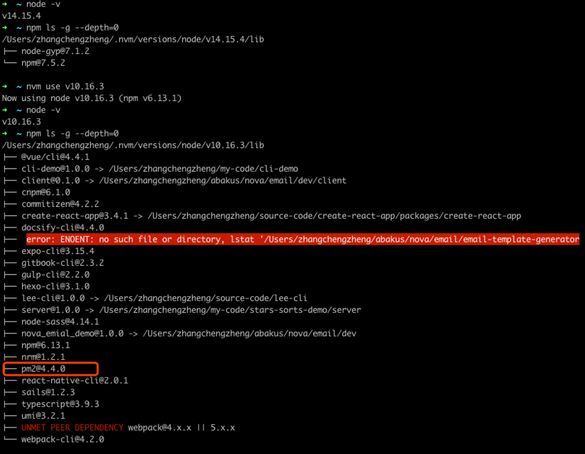

# node 版本切换问题

## 问题描述

在 nova 项目升级的时候，为了使用高版本 node.js 带来的高性能，决定将 node.js 的版本升级到到 LTS 14.16.0。

在这个过程中发现了一个诡异的问题：

在网上查了好多资料，发现了一个靠谱的资料

在 /.nvm/versions/node 目录下，运行 **tree -L 3** 命令，可以打印出每个当前机器上安装的所有 node.js 版本，以及每个版本对应的 bin。每个版本的 bin 目录内容不一致。很当前版本下的依赖一致。

## 参考链接

[线上node服务的配置和维护，使用非root账户运行和sudo管理](https://cnodejs.org/topic/57216ea1fa48138c41110ec8)
